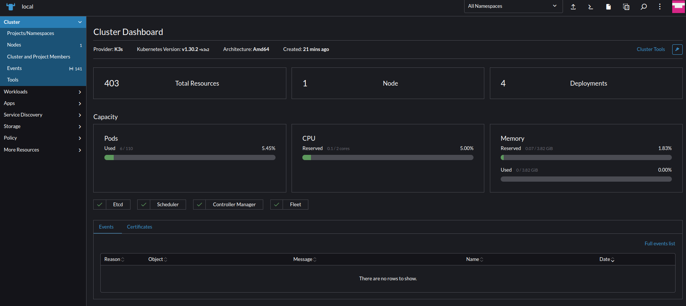

# Install Rancher with Docker

## Introducción
Rancher es una PaaS de código abierto que permite la ejecución de contenedores. 

Facilita y mejora la creación y gestión de clusters de Kubernetes y ofrece una interfaz de usuario muy accesible para supervisarlos y gestionarlos.

## Instalación

Instalar con docker:
```bash
docker run -d \
--restart=unless-stopped \
--privileged \
-p 80:80 \
-p 443:443 \
--name rancher_server \
rancher/rancher:latest
```

Recuperar password por Default:
```bash
docker logs rancher_server 2>&1 | grep "Bootstrap Password:"
```

Para ingresar al GUI de Rancher, (puede ser que tome un tiempo en el que el sitio este disponible) a la IP del host:

[https://192.168.0.191](https://192.168.0.191)

Cambiar la contraseña default por una generada de manera aleatoria 

E ingresar al Dashboard:



